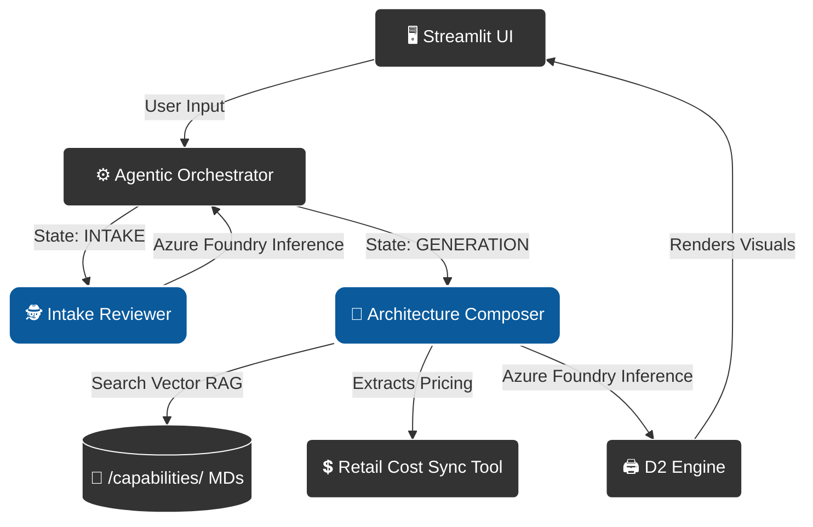

# Azure Architecture Agent

**The Technical Design Authority (TDA) Agent**

This system is a mature, stateful "Solution Architecture Composer". Moving past single-prompt Chat-over-PDF patterns, it utilizes a cyclical agentic routing loop (inspired by Microsoft Agent Framework concepts) to stringently intake user requirements against the Microsoft Well-Architected Framework, query a structured Capability RAG repository, and finally generate both a formal 5-point architecture document and a raw **D2 Visual diagram** mapped securely via Python subprocesses!

---

## 🛡️ Core Architecture Updates (Live MVP)

1. **Lean Boundary Mediation**: For the active MVP, the Azure Function trigger overhead has been decoupled. Streamlit natively invokes the `AgenticOrchestrator` synchronously. This allows for rapid, unified local development testing without Docker network proxy complexity.
2. **Secure Entra ID AI Identity**: Hardcoded API keys (`OPENAI_API_KEY`) are completely banned in this repository. Our factory (`m_agentfactory.py`) natively leverages `azure-ai-projects` and `azure-identity` (`DefaultAzureCredential`). Your underlying OS terminal login (`az login`) automatically issues temporary tokens over the data-plane using RBAC.
3. **D2 Diagram Visual Engine**: Using isolated Python `subprocess` bindings executing a static GO compilation of [D2](https://d2lang.com/), the LLM physically drafts SVG architectural diagrams rendered natively dynamically directly into the Streamlit Chat state.
4. **Structured RAG Repository**: The `/capabilities/` directory operates as a Git-backed Document Intelligence engine. It stores Markdown definitions enhanced with exact YAML Frontmatter targeting system constraints dynamically.
5. **Continuous Persistence**: The `ArchitecturePersister` (`src/utils/m_persist_design.py`) caches all successfully approved AI-generated SVG and MD deliverables securely onto timestamped local directories for history.

---

## 🧠 Agentic Application Architecture

The system achieves "Solution Architecture" reasoning not by using massive unmanageable monolithic prompts, but by stringing specialized agents together using a finite state machine loop called the **Agentic Orchestrator**:



---

## 🚀 Native Local Deployment

### Prerequisites
- **Python 3.10+** installed on your Windows Host.
- **UV** package manager (`pip install uv`).
- **Azure CLI** installed and authenticated via `az login` to a tenant holding **"Cognitive Services OpenAI User"** data-plane permissions over an active AI Foundry project.

### 1. Execution (Single Command)
Because we migrated into a Lean MVP architecture, startup is completely streamlined via UV:

```powershell
uv sync --frozen
uv run streamlit run src/ui/app.py
```
*(Access the UI immediately via `http://localhost:8501`)*

---

## 🐳 Container Validation (Production Parity)
Our Container respects strictly hardened Rootless Multi-Stage paradigms. 
The D2 engine `.tar.gz` is safely pulled within an isolated builder container, and only the raw static binary mapped directly into an `appuser` distroless linux runtime layer to eliminate arbitrary system vulnerability vectors.

```env
# No passwords or API keys needed. Your CLI token handles auth!
AIPROJECT_CONNECTION_STRING=endpoint=https://<REGION>.api.azureml.ms;subscription_id=<YOUR_SUB>;resource_group_name=<YOUR_RG>;workspace_name=<YOUR_HUB_PROJECT>

# Alternate raw endpoint parsing is also supported directly:
# AIFOUNDRY_CONNECTION_STRING=endpoint=...

# (Optional) Control pricing/performance via specific Models
AZURE_AI_MODEL=gpt-4o
```

```powershell
docker compose -f docker-compose.dev.yml up --build
```

---

## 📜 Agent Skills Framework (`.agents/skills/`)
AI Agents operating in this workspace act as the "Senior Educational Software Architect" and evaluate code geometry via three exclusive protocols:

1. **`design-architecture`**: Dictates component Single Responsibility and State routing logic. Enforces "Standard Library First".
2. **`design-infrastructure`**: Controls strict blast-radius isolation (Entra ID, Docker rootless constraints, Azure Networking limits).
3. **`review-code`**: Manages explicit code limits (`<30`-line function ceilings, 2-level indent limits, mandatory Type Hinting, & Guard Clauses).
