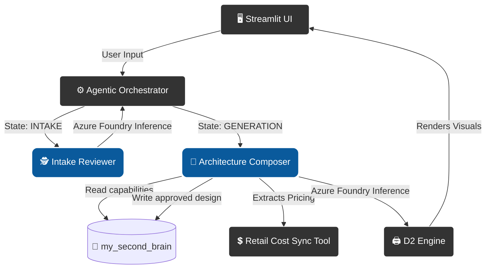

# azure_hello_world — Architecture Composition Engine

**AI-driven artifact creation: from requirements to approved architecture designs.**

This repository is one half of a two-repo system. It owns the **agentic pipeline** that turns raw requirements into formal architecture documents and D2 diagrams. Its companion repository, [`my_second_brain`](https://github.com/ysuurme/my_second_brain), owns the **knowledge store** that this engine reads from and writes to.

## Two-Repo Architecture

```
azure_hello_world                          my_second_brain
─────────────────────────────────          ──────────────────────────────────────
Architecture Composition Engine            Knowledge Repository & Daily Cockpit
─────────────────────────────────          ──────────────────────────────────────
• Agentic Orchestrator                     • Keep → Gemini → Drive note pipeline
• Intake Reviewer agent                    • Capability Framework (L1 / L2 / L3)
• Architecture Composer agent              • Technology cards
• Streamlit UI + D2 diagram rendering      • Architecture Design archive
• Azure AI Foundry client                    (templates + approved designs)
• GitHub Issue → PR automation             • Pattern Library
                                           • Domain models + filesystem adapters

        READS capabilities ──────────────────────────────────────►
        WRITES approved designs ◄────────────────────────────────
```

**Separation of concerns:** this repo stays focused on agent logic and UI; `my_second_brain` owns all artifact storage and retrieval. The Capability Framework (L1/L2/L3 with technology cards) lives in `my_second_brain` and is read here at runtime via filesystem adapters.

---

## Repository Structure

```
my_template_repo/
├── copier.yml                    Prompt definitions and generation config
├── LICENSE
├── README.md                     This file
├── main.py                       Entry point (templated)
├── pyproject.toml                Project metadata and dependencies
├── src/
│   ├── config.py                 Centralised config (pydantic-settings, loads .env)
│   └── utils/                    Generic transferable modules (m_*.py)
├── tests/                        Pytest suite, mirrors src/ hierarchy
├── .agents/skills/               Skill system — AI workflow for every generated project
├── .github/workflows/            CI: lint + typecheck + test
├── docs/adr/                     Architecture Decision Records (MADR format)
├── CONTEXT.md                    Domain glossary template (filled at generation time)
└── AGENTS.md                     Agent standing instructions (filled at generation time)
```

---

## Core Architecture

1. **Lean Boundary Mediation**: Streamlit natively invokes the `AgenticOrchestrator` synchronously, decoupled from Azure Function trigger overhead for rapid local development.
2. **Secure Entra ID AI Identity**: No hardcoded API keys. `m_agentfactory.py` uses `azure-ai-projects` + `DefaultAzureCredential`; `az login` issues temporary RBAC tokens automatically.
3. **D2 Diagram Visual Engine**: Python `subprocess` bindings execute a statically compiled [D2](https://d2lang.com/) binary; the LLM drafts SVG diagrams rendered live into Streamlit chat state.
4. **Capability RAG via `my_second_brain`**: At runtime, agents read the Capability Framework (L1/L2/L3 technology cards) from `my_second_brain` via filesystem adapters. The `/capabilities/` directory in this repo is a **transitional cache** — the canonical store is being migrated there.
5. **Approved Design Persistence**: `ArchitecturePersister` (`src/utils/m_persist_design.py`) writes timestamped SVG + MD deliverables into `my_second_brain`'s Architecture Design archive on approval.
6. **Diagram Persistence & Aesthetic Standard**: Diagram Studio renders against a single `DiagramStyle` standard (`src/utils/m_diagram_style.py`) and persists the trio (brief + d2 + svg) via `src/utils/m_diagram_store.py` — filesystem locally, project-scoped Azure Blob (`sthelloarchdev/diagrams`) in the cloud — enabling `/diagram list|open|delete` and multi-session build-forward.

---

## Agentic Pipeline

The system achieves solution architecture reasoning by routing through specialized agents in a finite state machine loop — the **Agentic Orchestrator** — rather than a single monolithic prompt:



---

## Local Deployment

### Prerequisites

To run this application locally, you must satisfy the following environment and identity requirements:

1.  **Python 3.10+** installed on your Windows Host.
2.  **UV** package manager (`pip install uv`).
3.  **Azure CLI** installed and authenticated via `az login`.
4.  **Azure RBAC Role**: Your user account must have the **"Cognitive Services OpenAI User"** role assigned on the Azure AI Foundry project or its parent Resource Group.
5.  **Environment Variables**: Create a `.env` file in the project root with:
    - `AZURE_AAIF_PROJECT_ENDPOINT`: The endpoint for your AI Foundry project (e.g., `https://<REGION>.api.azureml.ms`).
    - (Optional) `SECOND_BRAIN_PATH`: Absolute path to your local `my_second_brain` repository (e.g., `/home/user/my_second_brain`). When set, `CapabilityRepository` reads from `$SECOND_BRAIN_PATH/capabilities/` and approved designs are written to `$SECOND_BRAIN_PATH/architecture/designs/approved/`. If unset, the engine falls back to local project directories (safe for CI).
    - (Optional) `AZURE_AUTH_MODE`: `cli` (default) uses `az login` — fine for running the app natively on the host. The `sp` value forces Service Principal credential lookup (`EnvironmentCredential`) and is the path used when running the app **in a local container**, which must authenticate as a workload identity rather than depend on the host's `az login`. Neither path is used by CI (OIDC federation) or the cloud runtime (UAMI). See the 3-tier identity model in ADR-015.
    - (Optional) `AZURE_CLIENT_ID`, `AZURE_TENANT_ID`: the scoped Service Principal (`sp-helloarch-dev`); set for `AZURE_AUTH_MODE=sp`. `AZURE_CLIENT_SECRET` is **injected at launch** by `task dev` (fetched from the central platform Key Vault `kv-platformy-dev`), not stored in `.env`. Leave all three empty for plain `az login` usage.
6.  **Model Deployments**: Ensure the following models are deployed in your AI Foundry project with names matching `config.py`:
    - `gpt-5-mini` (Intake Reviewer)
    - `DeepSeek-V3.1` (Architecture Composer)

Verify your setup by running:
```powershell
task agent:check
```

### 1. Execution (Single Command)
Because we migrated into a Lean MVP architecture, startup is completely streamlined via Task:

```powershell
task dev
```
*(Access the UI immediately via `http://localhost:8501`)*

`task dev` runs `.github/scripts/dev-up.ps1`, which fetches the `helloarch-sp-client-secret` from the central platform Key Vault (`kv-platformy-dev`) via `az`, injects it as `$env:AZURE_CLIENT_SECRET` for the compose run only (scrubbed in `finally`), and brings up the stack with hot-reload (`docker-compose.override.yml` mounts `./src`, uvicorn `--reload`, streamlit `--server.runOnSave`). The container authenticates to Azure as the Service Principal — no `az login` inside the container. Pass `-Detach` to run detached.

### 2. Start the MCP Bridge (Local Coding Specialist)
To enable the agent to perform local code-writing and refactoring (the "Coding Specialist" role), you must start the MCP bridge in a separate terminal:

```powershell
task agent:local
```
*(This bridges the cloud-based Thinking Engine with your local environment securely. Note: This process remains running while you are developing.)*

### Bootstrap: single shared ClientManager

Create one `ClientManager` at application startup and pass it to the `AgenticOrchestrator` so every agent shares the same authenticated clients and credentials lifecycle:

```python
from src.utils.m_ai_client import ClientManager
from src.utils.m_orchestrator import AgenticOrchestrator

cm = ClientManager()  # uses DefaultAzureCredential (az login or service principal env vars)
orchestrator = AgenticOrchestrator(client_manager=cm)
```

Set `AZURE_AAIF_PROJECT_ENDPOINT` in your `.env` before running. For plain native `az login` dev, leave `AZURE_CLIENT_ID`/`AZURE_TENANT_ID`/`AZURE_CLIENT_SECRET` empty. For local *container* dev (`AZURE_AUTH_MODE=sp`), set the SP id/tenant; the secret is injected at launch from the central Key Vault by `task dev` (never committed to `.env`, never set in CI or cloud).

## Code Validation
```powershell
task test
```

## Container Validation (Production Parity)
Our Container respects strictly hardened Rootless Multi-Stage paradigms. 
The D2 engine `.tar.gz` is safely pulled within an isolated builder container, and only the raw static binary mapped directly into an `appuser` distroless linux runtime layer to eliminate arbitrary system vulnerability vectors.

```env
# No passwords or API keys needed. Your CLI token handles auth!
AIPROJECT_CONNECTION_STRING=endpoint=https://<REGION>.api.azureml.ms;subscription_id=<YOUR_SUB>;resource_group_name=<YOUR_RG>;workspace_name=<YOUR_HUB_PROJECT>

# Alternate raw endpoint parsing is also supported directly:
# AIFOUNDRY_CONNECTION_STRING=endpoint=...

# (Optional) Control pricing/performance via specific Models
AZURE_AI_MODEL=gpt-4o
```

```powershell
docker compose -f docker-compose.dev.yml up --build
```

---

## Cloud Deployment (Azure)

The `infra/` Terraform stack provisions the full backend on Azure, **secretless in the cloud** — all auth flows through managed identity, never a client secret.

```
crhelloarchdev (ACR) ──AcrPull(UAMI)──► ca-helloarch-api (Container App, internal ingress :8000)
id-helloarch-api (UAMI) ──Azure AI Developer + Cognitive Services User──► aaif-helloarch-dev (Foundry)
```

**What it provisions** (`rg-helloarch-dev`, `swedencentral`):
- **Foundry** — AIServices account + `helloarch` project + Mistral model deployments (`mistral-small-2503`, `Mistral-Large-3`, `Codestral-2501`).
- **ACR** `crhelloarchdev` (admin disabled — pull via UAMI only).
- **Backend Container App** `ca-helloarch-api` — internal ingress, runs the FastAPI image, identity = user-assigned `id-helloarch-api`. No public `/dispatch`.
- **Project diagram storage** `sthelloarchdev` (container `diagrams`) — account keys disabled, blob versioning + soft-delete; holds the Diagram Studio trio (brief + d2 + svg) for multi-session build-forward. **Project-scoped** — dies with `rg-helloarch-dev` (ADR-016 amendment); distinct from platform/knowledge storage.
- **Identities & RBAC** — a 3-tier identity model (ADR-015): **native host dev** uses `az login`; **local containers** authenticate as the scoped Service Principal `sp-helloarch-dev` via a client secret stored in the central platform Key Vault `kv-platformy-dev` (created out-of-band via `az`, never in Terraform state — the no-secret-in-state invariant holds); **CI** uses OIDC federation; the **cloud runtime** uses the UAMI `id-helloarch-api` (AcrPull + Azure AI Developer + Cognitive Services User). The SP and the UAMI each hold **Storage Blob Data Contributor** on the project diagram account `sthelloarchdev`.

**Provider:** azurerm `~> 4.0` (validated on v4.74.0), azapi `~> 2.0`, azuread `~> 2.0`. Remote state in Azure Storage (ADR-015).

**State backend:** Terraform state is stored remotely in a shared platform storage account (`stplatformydev`, container `tfstate`, key `helloarch/terraform.tfstate`), provisioned once as standalone platform infrastructure in `rg-platformy-dev` — deliberately separate from this project's resource group so it survives `az group delete rg-helloarch-dev`. See ADR-015.

```powershell
# azurerm v4 requires a subscription at plan/apply (validate does not):
$env:ARM_SUBSCRIPTION_ID = (az account show --query id -o tsv)

cd infra
terraform init
terraform validate
terraform plan
```

**Image tag:** the backend image is referenced by `var.image_tag` (default `latest`). CD should pass the git SHA (`-var "image_tag=$(git rev-parse --short HEAD)"`) so each revision is deterministic and Terraform detects image changes.

**First-apply ordering (cold start):** the Container App references an image that does not exist in ACR until it is pushed. On a clean apply, provision the registry + identity first, push the image, then apply the app:
```powershell
terraform apply -target=azurerm_container_registry.acr -target=azurerm_user_assigned_identity.api
# build & push helloarch:<tag> to crhelloarchdev, then:
terraform apply
```

**Resource-provider registration:** auto-registration is disabled (`resource_provider_registrations = "none"`); the stack registers exactly its namespaces via `resource_providers_to_register`. If your identity lacks `/register/action`, register them by hand: `az provider register --namespace "Microsoft.App"` (repeat per namespace).

**Teardown (Cognitive Services soft-delete):** `az group delete -n rg-helloarch-dev` deletes the RG, but the Foundry/AIServices account is **soft-deleted** — recreating `aaif-helloarch-dev` afterwards fails until it is purged:
```powershell
az cognitiveservices account purge -g rg-helloarch-dev -n aaif-helloarch-dev -l swedencentral
```

**Status:** Stack fully managed by Terraform with remote state as the source of truth; rebuilt clean (manual-bootstrap drift reconciled by destroy + recreate). Backend image deployed; the Container App runs **scaled-to-zero behind internal ingress** — first request cold-starts, and it is not publicly reachable. `/diagram` is fully functional; `/design` runs degraded pending ADR-016 (see interim note below). End-to-end runtime (`/healthz` → ok, `/diagram` → SVG via UAMI→Foundry) was validated on the equivalent pre-rebuild stack; re-validating the rebuilt stack requires reaching the internal FQDN from within the Container Apps environment.

> **Caveat:** local `docker compose` may still run an image built before the Dockerfile `/app` permission fix (`chown` + switch user *after* COPYs). A `docker compose build` picks up the deterministic fix.

> **Known interim (ADR-016):** the cloud image ships only `src/` + the venv, not `capabilities/` or `architecture/`. So in the cloud, `/diagram` is fully functional but `/design` degrades to default WAF guidance and a stub intake template. These are being externalized to cloud storage for runtime retrieval (see `ISSUES.md`); not baked into the image.

---

## Agent Skills Framework (`.agents/skills/`)
AI Agents operating in this workspace act as the "Senior Educational Software Architect" and evaluate code geometry via three exclusive protocols:

1. **`design-architecture`**: Dictates component Single Responsibility and State routing logic. Enforces "Standard Library First".
2. **`design-infrastructure`**: Controls strict blast-radius isolation (Entra ID, Docker rootless constraints, Azure Networking limits).
3. **`review-code`**: Manages explicit code limits (`<30`-line function ceilings, 2-level indent limits, mandatory Type Hinting, & Guard Clauses).

---

## Agentic Development (GitHub Issues → PR)

Development tasks execute through a headless "Director Workflow" — create an issue from your phone, and a local agent listener builds, tests, and delivers a PR for your review.

### Full Validated Workflow

```
📱 Phone: Create issue + label 'agent:dev'
    │
    ▼
🤖 Listener picks up issue → label: agent:in-progress
    │
    ├─ Phase A: Refine
    │   Read raw issue → formalize into Goal/Description/Requirements/AC
    │   Post refinement comment on issue
    │
    ├─ Phase B: Develop
    │   git checkout main → git pull → git checkout -b feature/issue-N
    │   Gemini CLI reads issue, follows GEMINI.md + .agents/skills/
    │   Implements changes → runs task test && task lint
    │
    ├─ Commit & PR
    │   git commit -m "feat(#N): Title" → git push origin HEAD
    │   gh pr create --reviewer ysuurme --project @hello_architect
    │   PR body: summary, validation status, Closes #N
    │
    ├─ Agent Self-Review
    │   gh pr review --comment (diff stats + quality checklist)
    │   All agent notes posted on PR for full transparency
    │
    └─ Handoff
        Label: agent:review → issue moves to Review lane
        GitHub Action pr-checks.yml runs lint + test (Critic)
        │
        ▼
📱 Phone: Review PR → Approve → Merge → Branch auto-deleted
```

### Label Lifecycle

| Label | Meaning |
|-------|---------|
| `agent:dev` | Queued for agent pickup |
| `agent:in-progress` | Agent is working (refine + develop) |
| `agent:review` | PR created, agent review posted, awaiting human approval |
| `agent:completed` | Human approved and merged |
| `agent:failed` | Agent error (see issue comments) |

### Running the Listener

```powershell
task agent:listen
```

> **⚠️ Temporary Architecture**: Laptop-based polling listener. If laptop sleeps, tasks are silently dropped. Future target: event-driven GitHub Codespaces.

### Key Design Decisions

- **Gemini CLI** is the Builder (writes code). **GitHub Actions** is the Critic (validates PRs). `gh` CLI handles plumbing (branches, labels, PRs).
- **Branch naming**: `feature/issue-N` — consistent, grep-friendly, auto-cleaned on merge.
- **Commit format**: `feat(#N): Title` — conventional commits, machine-parseable.
- **Agent reviews its own PR** with diff stats and a checklist. Human approval is always required.
- **`@hello_architect` project** receives all PRs. Issues move to the Review lane automatically.

### MCP Bridge Architecture (Local Code Generation)

The headless agent uses a local LM Studio model for code generation via the MCP (Model Context Protocol) bridge. This offloads routine code-writing from premium cloud models to a local GPU-resident model, reducing API costs while maintaining code quality.

**The Problem:** The Gemini CLI spawns MCP servers as child processes using Node.js `child_process.spawn()` with stdio pipes for JSON-RPC communication. On Windows, this creates two fatal issues:
1. **Batch file pipe closure**: `npx.cmd` is a Windows batch wrapper. When Node spawns `.cmd` files, the stdio pipe handles are destroyed by the intermediate `cmd.exe` shell, severing the MCP connection instantly (`MCP error -32000: Connection closed`).
2. **stdout pollution**: The bridge package (`@intelligentinternet/gemini-cli-mcp-openai-bridge`) writes startup logs and ANSI escape codes to `stdout` via `console.log()`. MCP JSON-RPC mandates that stdout carry exclusively JSON messages. Any non-JSON text on stdout causes the Gemini CLI to interpret it as a malformed RPC response and kill the connection.

**The Solution: SSE HTTP Transport.** Instead of stdio, the bridge runs as a persistent background HTTP server managed by `agent-listener.ps1`:

```
agent-listener.ps1 → Start-Process node [..., --port 3100] → bridge HTTP server
Gemini CLI → settings.json: { "url": "http://localhost:3100/mcp" } → clean HTTP JSON-RPC
```

Key implementation details:
- **`Invoke-EnvironmentBootstrap`** resolves the bridge's JS entry point via `npm root -g`, starts it as a background process on port 3100, and tracks the PID for lifecycle management.
- **`settings.json`** is generated dynamically with UTF-8 No-BOM encoding (PowerShell's `Set-Content -Encoding UTF8` injects a BOM that crashes JSON parsers) using `[System.IO.File]::WriteAllText()`.
- **Validation gates**: Before the listener enters its polling loop, it sequentially validates: (1) LM Studio REST API connectivity, (2) target model loaded in VRAM via `/v1/models`, (3) live inference via a hello-world `chat/completions` call, (4) bridge process is alive on port 3100. If any check fails, MCP is gracefully disabled and the pipeline falls back to pure cloud models.
- **`Invoke-EnvironmentTeardown`** kills the bridge process, ejects the model from VRAM (`lms unload --all`), and stops the LM Studio server.
- **Debug mode** (`task agent:listen:debug`) sets `KEEP_MODELS_LOADED=true`, skipping VRAM load/unload cycles during rapid iteration.

**Configuration** (`.env`):
```env
LOCAL_AI_MODEL=nerdsking-python-coder-3b-i
```

---

## Project Governance

> **All agents (Gemini, Claude, or other) must read `AGENTS.md` and `CONTEXT.md` on startup.** They are the single source of truth for project rules, architecture, coding standards, and driver-specific delegation behaviour.

| File | Role |
|------|------|
| `AGENTS.md` | **Primary agent instruction file.** Rules, model delegation (Gemini + Claude drivers), safety boundaries. Read this first. |
| `CONTEXT.md` | **Domain context and codebase topography.** Architectural glossary, system map, component fan-in/fan-out. |
| `.agents/skills/` | Coding enforcement protocols (`review-code`, `design-architecture`, `design-infrastructure`, `git-workflow`). |
| `Taskfile.yml` | Single source of truth for all commands. `task --list` to discover. |
| `ISSUES.md` | **Single source of truth for the project roadmap.** All future improvements, features, and bugs are written here. |

### Adding Improvements

All future work — features, bugs, refactors — must be captured as `ISSUE:…END_ISSUE` blocks in `ISSUES.md`. After syncing, the block is automatically removed from `ISSUES.md` to prevent duplicate uploads.

```
1. Write the issue in ISSUES.md (Goal / Description / Requirements / Acceptance Criteria)
2. Run `task sync` to push to GitHub and the @hello_architect project
3. Label with `agent:dev` for automated execution, or work it manually
```

This ensures every improvement is tracked in GitHub, reviewable from mobile, and executable by the agent listener.
