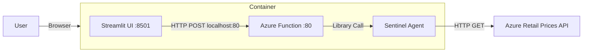

# Architecture: Local Minimum Viable Application (MVA)

## Overview
This document outlines the local validation architecture for the Azure Architecture Sentinel. It consolidates the backend Azure Function (Agent) and the Streamlit frontend into a single "Monolithic" container for simplified deployment.

## Components

1.  **Unified Container**
    *   **Tech**: Streamlit (Python) & Azure Functions (Python).
    *   **Role**: Hosts both the UI and the Agent logic.
    *   **Network**: Internal communication via `localhost`.
    *   **Ports**: 
        - `80`: Azure Function API.
        - `8501`: Streamlit UI.

## Data Flow
1.  **User** inputs query into Streamlit.
2.  **Streamlit** POSTs JSON to `http://localhost:80/api/AdvisorTrigger`.
3.  **Azure Function** triggers `ArchitectureAdvisorAgent`.
4.  **Agent** runs Maker-Checker loop.
5.  **Agent** calls `calculate_cost` tool (Live API).
6.  **Response** returns to Streamlit for rendering.

## Diagram
